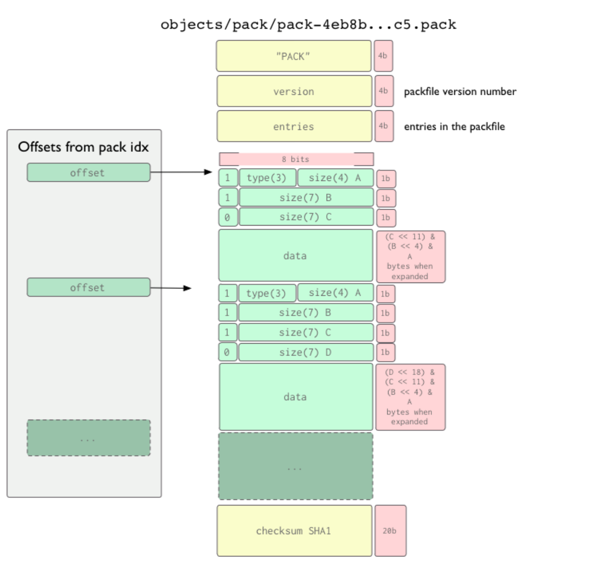
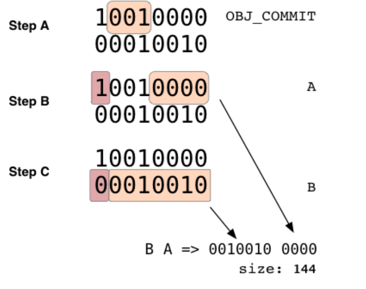

# Git存储原理分析

## git 对象生命周期和 git 对象间的关系

分析 git 对象的生命周期和对应关系。对于 git 对象 现在阶段 需要分析 commit、 tree、 blob 三种类型的文件，几种对象的状态，存储方式要实现对提交内容实现数据库支持的检索。

git 生命周期：git init，初始化git项目，生成 .git 文件夹创建文件并git add之后，会生成一个文件对应的 blob 对象 存储到 松散区 .git/object 文件夹git commit 之后，会生成tree对象和 commit对象存储到  .git/object

git 对象的对应关系：一个 commit 对应一个 tree一个 tree 对应 1个 blob+1个tree （n>=0）一个 tag 对应 一个 commit

## 一、储存对象方式

Git 保存对象的格式有两种——松散对象和打包对象。

### git对象储存目录设计逻辑

.git/objects 目录的设计逻辑(在 objects 目录下生成文件夹和文件)

数据blob对象、树tree对象和提交commit对象都是在.git/objects目录下以key-value形式存储，key是Git对象的40位hash，在文件系统里分为两部分：头两位作为文件夹，后38位作为对象文件名（目的是减少文件夹下的文件数目，查找更快）。

hash的计算：

> header = "\<type>" + " (空格)" + content.length(数据内容的字节数) + "\0"
>
> hash = sha1(header + content)

tree/blob/commit object 对象的存储机制:

Git对象会在原内容前加个一个头部：

> store = header + content

头部

> header = "\<type>" + content.length + "\0"
> hash = sha1(header + content)

Git对象在存储前，会使用zlib的deflate算法进行压缩，即简要描述为：

> zlib_store = zlib.deflate(store)

content内容保存方式

> 文本、图像、音频。。。。。
>
> store = header + content 二进制拼接

## 二、Git Object

object 对象的存储机制

#### 数据对象 blob

blob \<content length>\<NULL>\<content>

- 储存文件内容，不包括文件名，经过SHA1哈希算法得到对应的哈希值

#### 树对象 tree

tree \<content length>\<NULL>\<file mode> \<filename>\<NULL>\<item sha>...

- \<item sha>部分是二进制形式的sha1码，而不是十六进制形式的sha1码。
- 树对象，作用是存储目录信息，包含了n条树对象记录和n个数据对象记录，
- 其中每条记录都指向一个数据对象或者是子树对象的SHA-1指针以及相应的模式、类型、文件名

#### 提交对象 commit

>commit \<content length>\<NUL>tree \<tree sha>
>
>parent \<parent sha>[parent \<parent sha> if several parents from merges]
>
>author \<author name> \<author e-mail> \<timestamp> \<timezone>
>
>
>
>committer \<author name> \<author e-mail> \<timestamp> \<timezone>​
>
>\<commit message>

- 提交对象中包含一个树对象条目，代表着当前项目快照
- 其他之外还有一些作者/提交者的信息，
- 最后一行是提交注释。

一个 commit 可能会有多个 parent

#### Tag

- **Tag 对象:**打上 tag 之后，这个 tag 代表的内容将永远不可变，因为 tag 只会关联当时版本库中最后一个 commit 对象。
- Tag 类型有两种：
- **1 lightweight (轻量级)**   git tag tagName
- 这种方式创建的 Tag，git 底层不会创建一个真正意义上的 tag 对象，而是直接指向一个 commit 对象，此时如果使用 git cat-file -t tagName 会返回一个 commit。
- **2 annotated (含附注)**    git tag -a tagName -m''
- 这种方式创建的标签，git 底层会创建一个 tag 对象，tag 对象会包含相关的 commit 信息和 tagger 等额外信息，此时如果使用 git cat-file -t tagname 会返回一个 tag

##### tag 内容

> object d5d55a49c337d36e16dd4b05bfca3816d8bf6de8   //commit 对象SHA-1
>
> type commit
>
> tag v3    //tagName
>
> tagger xxx  1506230900 +0800 //本次commit的人
>
>
>
> message

#### branch

本质上是一个有名字的指针，指向特定的commit

- 指向自己的最新的commit

HEAD文件指针：指向当前工作分支的最新commit

- 分支保存在 .git/refs/heads/（分支名：指向->commit）

#### remote

- 执行git remote add origin [http://xxxxxxx](http://xxxxxxx/)
- 生成 .git/config

> [remote "origin"]
>
>  url = 远程仓库地址
>
>  fetch = 对应远程仓库本地仓库分支信息git

- 本地生成远程远程仓库信息
  - .git/refs/remotes/（sha-1->分支指向commit）

## 三、Git Packfile

### git 对象的压缩

- 压缩主要是 blob，add 之后就会压缩（压缩率不同，重复率高的txt压缩率高，二进制文件反而比原始文件大一些），1、使用 zlib 进行压缩。2、相同 hash 只存一个 ，在创建新的提交时，Git sha-1对提交中每个跟踪文件的内容进行散列，以与它已有的所有对象的散列进行比较。如果文件的哈希值匹配现有对象的哈希值，那么 Git 不会为该文件存储任何新内容。
- git gc 后，再次压缩（文件存储第一版对象和第二版对象存储的差异）---> 出现两个文件 idx、pack；

packfile 信息格式

> SHA-1 type size size-in-packfile offset-in-packfile depth base-SHA-1

git gc 之后 打包成一个packfile，offset-in-packfile 记录在packfile内的偏移量

### pack 目录下的逻辑(idx、pack)

- 上面都是松散区，当增加大量内容大小几乎完全相同的对象， 手动执行 git gc 命令，或者向远程服务器执行推送时，这些对象打包成一个称为“包文件（packfile）”的二进制文件。
- 原理：Git 会完整保存其中一个，再保存另一个对象与之前版本的差异内容。即Git将只保存第二个文件中更改的部分，并使用一个指针指向与之相似的文件。并使用一个指向该文件的指针。
- 具体过程：会新创建一个包文件pack和一个索引 idx，包文件包含了打包时从文件系统中移除的所有对象的内容。 索引文件包含了包文件的偏移信息，通过索引文件就可以快速定位任意一个指定对象。
- git verify-pack 命令查看已打包的内容
- 1,2,3 commit - pack1 idx1; 4,5 commit - pack2 idx2;

### 索引

1、header ： 索引文件头 8个字节 前四个字节总是255、116、79、99，后四个字节四个字节显式地表示版本号

2、fanout table ：扇出表，256个条目，每个条目4字节，总长度为1024字节

​	00、01、02 ... ff； Fanout[0] = 01：00 开头 的 10个、Fanout[1] = 10：01 开头 的 9个、... 、Fanout[255] 共多少个对象，以及 Fanout[255] - Fanout[254] 个 ff 开头的对象

3、按顺序包含20字节的对象名称

4、每个对象的 packfile 偏移量 每个条目也有四个字节， 小于2gb MSB 为0，大于为1 偏移量存在第五层

5、大于2gb 的 packfiles

6、packfile 的20字节校验和和整个索引文件的20字节校验和。

### packfile 

push 因为只传输packfile文件， 所以我们首先要从 packfile 中解析出 packfile 的索引，

Packfile 以12字节的元信息开始，以20字节的校验和结束。前四个字节拼写为“ PACK”，后四个字节包含版本号——在我们的程序中是[0,0,0,2]。接下来的四个字节是包中包含的对象数，所以一个 packfile 不能包含超过2^32个对象。后面是一系列打包的对象，按照它们的 SHAs 顺序排列 由一个对象头和对象内容组成。Packfile 的末尾是该 packfile 中所有 shas (按排序顺序)的20字节 SHA1和。

Packfile 的核心是一系列打包的对象，每个数据块前面都有一些元信息。

元信息后面的数据是 zlib 压缩的对象数据。

元信息是由一个或多个1字节(8位)大块组成的序列，用于指定以下数据的对象类型以及展开时的数据大小。每个字节实际上是7位的数据，第一位用来表示数据开始之前是否是最后一位。如果第一位是1，那么将读取另一个字节，否则数据将从下一位开始。根据下表，第一个字节的前3位指定了数据的类型。

> obj_commit = 001
>
> obj_tree = 010
>
> obj_blob = 011
>
> obj_tag = 100
>
> obj_ofs_delta = 110
>
> obj_ref_delta = 111

两种特别的压缩方式：

- ofs（同一个 packfile）
  - 表示的是 Delta 存储，当前 git 对象只是存储了增量部分，对于基本的部分将由接下来的可变长度的字节数用于表示 base object 的距离当前对象的偏移量，接下来的可变字节也是用 1-bit MSB 表示下一个字节是否是可变长度的组成部分。对偏移量取负数，就可知 base 对象在当前对象的前面多少字节
- ref （不通 packfile）
  - 表示的是 Delta 存储，当前 git 对象只是存储了增量部分，对于基本的部分，用 20-bytes 存储 Base Object 的 SHA-1 。

## 

[Git - Book](https://git-scm.com/book/zh/v2)

[Unpacking Git packfiles (recurse.com)](https://codewords.recurse.com/issues/three/unpacking-git-packfiles)

[Git Book - The Packfile (shafiul.github.io)](http://shafiul.github.io/gitbook/7_the_packfile.html)

[Git - 传输协议 (git-scm.com)](https://git-scm.com/book/zh/v2/Git-内部原理-传输协议)

[launchbadge/sqlx: 🧰 The Rust SQL Toolkit](https://github.com/launchbadge/sqlx)

[tokio-rs/axum](https://github.com/tokio-rs/axum)
